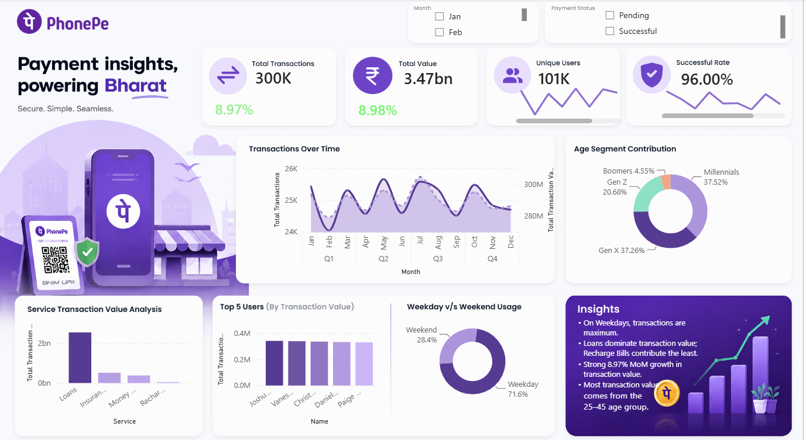

<h1 align="center">📊 PhonePe Transaction Analysis Dashboard</h1>

Power BI • DAX • Power Query • Data Modeling • Interactive Dashboard

 

## 🚀 Project Overview

This dashboard enables users to:

- 📈 Analyze monthly transaction trends
- 💰 Monitor transaction value and volume
- 👥 Explore user demographics
- 🏦 Compare service-wise performance
- 📅 Analyze weekday vs weekend activity
- 📊 Track Month-over-Month (MoM) growth
- 🎯 Interact with dynamic slicers and custom tooltips

---

## 🛠️ Tech Stack

- Power BI Desktop
- Power Query
- DAX
- Data Modeling

---

## 📚 Key DAX Functions

- `CALCULATE()`
- `DATEADD()`
- `DISTINCTCOUNT()`
- `SUM()`
- `FORMAT()`
- `IF()`
- `WEEKDAY()`
- `CALENDAR()`
- `ADDCOLUMNS()`

---

## 📊 Key Insights

- 📌 Loans contribute the highest transaction value.
- 📌 Recharge Bills contribute the least.
- 📌 Transaction value shows positive MoM growth.
- 📌 Weekday transactions exceed weekend activity.
- 📌 Adults represent the largest user segment.

---

## 💡 Skills Demonstrated

- Data Cleaning & Transformation
- Data Modeling
- DAX & Time Intelligence
- KPI Development
- Interactive Dashboard Design
- Business Analysis

---

## 👨‍💻 Author

**Lakshay**

**Aspiring Data Analyst | Data Engineering Enthusiast**

**Skills:** SQL • Power BI • Python • Excel • Azure • ETL • Data Warehousing • DAX

---

⭐ **If you found this project useful, consider giving it a Star!**
